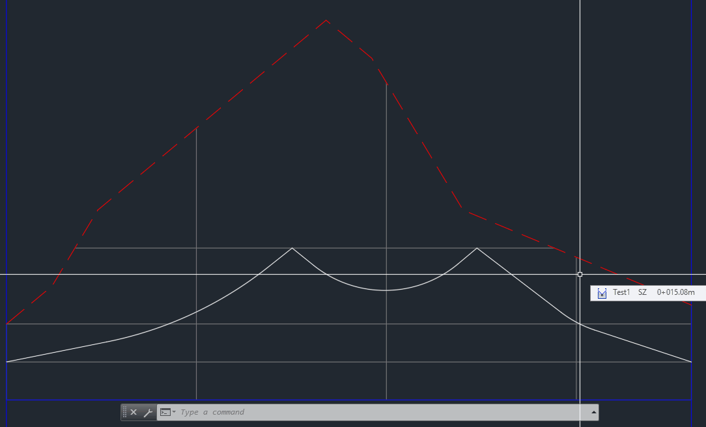

# ProfileToolBox
ProfileToolBox: tool to create Autodesk Civil 3D profiles in a profile view based on a polyline.


I needed to draw profiles in profile views in Civil 3D based on a polyline and I found the ProfileToolBox tool at: https://forums.autodesk.com/t5/civil-3d-forum/profile-from-polyline/m-p/6012180/highlight/true#M293493 but it didn't work!

So, today, I got the idea to decompile it and try to figure out what goes wrong. I already had some Revit API programming experience, but no Autocad experience, so it was fun to try. Also, I hope I don't violate any copyright laws by doing this this way -- I do not know the original creator of this tool, so I cannot ask in advance!

I found two problems in the code, which I think fixed the tool:

Problem 1:
The tool was creating a new profile, but it didn't contain any visible geometry. I think this was because the newly created profile wasn't opened for writing -- hence the change.
Original:

```c#
Profile profile = tx.GetObject(profByLayout, OpenMode.ForOpen) as Profile;
```

Changed to:

```c#
Profile profile = tx.GetObject(profByLayout, OpenMode.ForWrite) as Profile;
```

Problem 2:
There is a section in the code, which tries to get the mid point of a polyline arc, but it was doing it with 10 points choosing 6th point -- which isn't the mid point. I changed it to 11 points choosing 5th point -- remember, the index of points is zero-based -- this gives the correct midpoint.
Original:

```c#
Point2d samplePoint = ((Curve2d)arcSegment2dAt).GetSamplePoints(10)[6];
```

Changed to:

```c#
Point2d samplePoint = ((Curve2d)arcSegment2dAt).GetSamplePoints(11)[5];
```

The tool worked on first compile after that, see gif for proof. ;)

To get it to work, download the compiled .dll (here)[https://github.com/shtirlitsDva/ProfileToolBox/releases] or compile it your self in VisualStudio and use 'netload' in acad to load the tool. Then call command: 'mypfp' to start the profile creation process.
